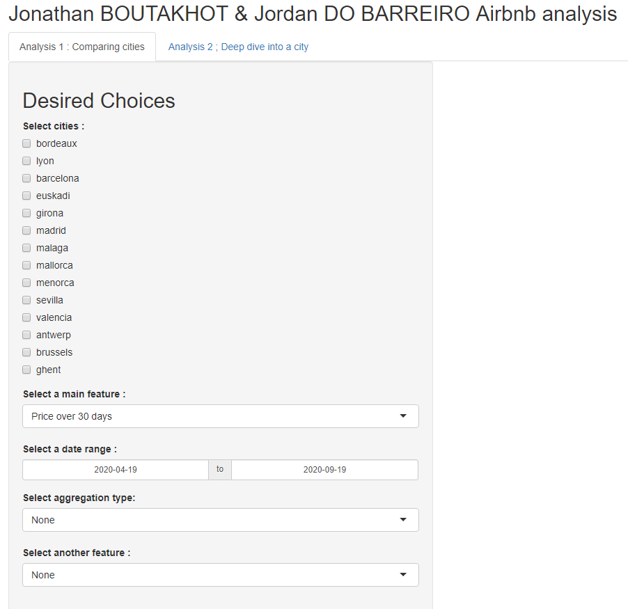

```{r setup, include=FALSE}
knitr::opts_chunk$set(echo = FALSE)
```


```{r}

```
## Introduction

Our team is composed of only 2 members : 

BOUTAKHOT Jonathan and DO-BARREIRO Jordan

We are both in our last year of engineering school in ECE Paris, and this is our Airbnb Data Analysis Project

In this project, we will be able to download the data from Airbnb, prepare it, 
and display some useful features and compare them between several cities 
from 3 differents countries : France, Spain, and Belgium

We can acquire a lot of data from many cities from their website <http://insideairbnb.com/get-the-data.html>

## Data Preprocessing
We read the data from the urls.csv file, then split the features, then apply our filters then it is loaded 
```R
  urls_path <- file.path("./Data/all_data_urls.csv")
  print(paste0("reading data from ", urls_path))
  urls_df <- read.csv(urls_path)

  #split different features
  urls_features <- str_split_fixed(urls_df$listings_data_url, "/", 8)
  
  urls_df$country <- urls_features[,4]
  urls_df$city <- urls_features[,6]
  urls_df$date <- urls_features[,7]
```

## Some filters
We apply our filters, and then it is loaded !
```R
#apply filters : 3 different countries (france without paris, spain, belgium) and the last 3 available scraping dates of data
  urls_df <- urls_df %>%
    filter(country %in% c("france","spain","belgium")) %>%
    filter(city !="paris")
  urls_df <- urls_df %>%
    group_by(city) %>%
    slice_max(order_by = date, n = 3)

  print("urls loaded")
  return(urls_df)
```


## Tab1 - Overview

{width=500px}


{width=500px}

## Tab1 - Comparing several cities on a feature


{width=800px}

## Tab1 - Up to two features at the same time !

{width=800px}

## Tab2 - Overview

{width=450px}

## Tab2 - City insights with an additionnal map

{width=800px}

## Conclusion

Finally, this project was realised thanks to our courses in Data Analytics, and it gave us the opportunity to practice 
the R programming language, combined to an Shiny application to make a interactive user interface in real time.

We are not experts, even if we are only a group of 2 people, we tried our best and we really enjoyed learning a lot of things through the realisation of this project.

We may want to improve our competence again and again, and to practice more and more, to do in the future a better job.

Thank you for your listening !

